0. `docker compose up` -> connect to the admin console as admin http://localhost/keycloak (username: admin / pwd: change-me) and change to Orthanc Realm
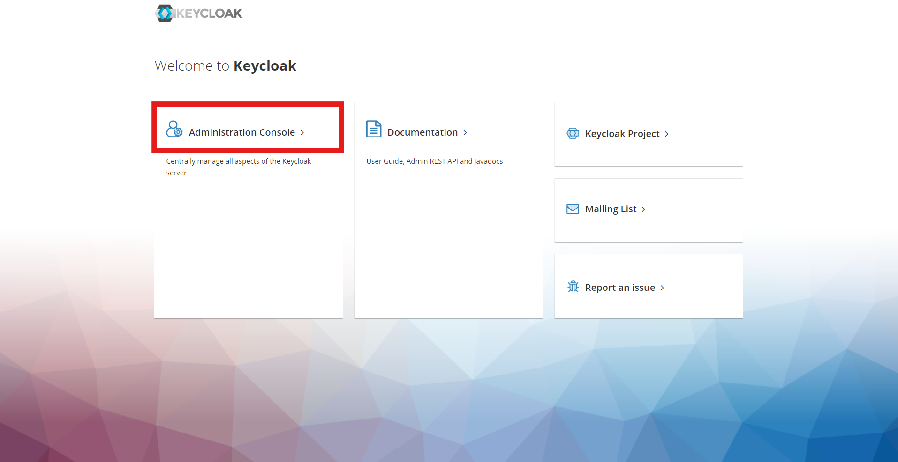
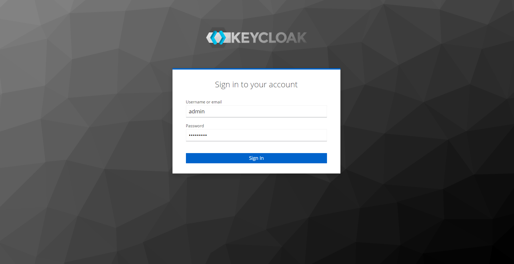
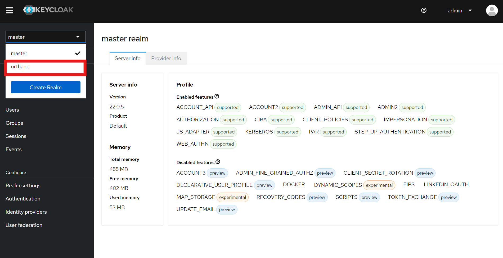
1. add a Realm Role 
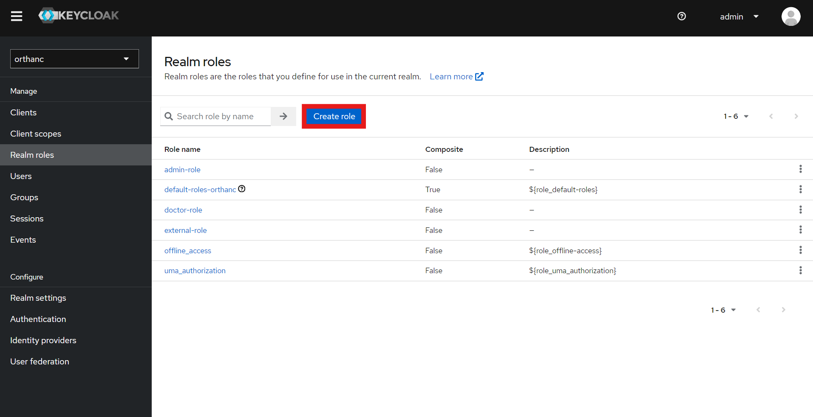
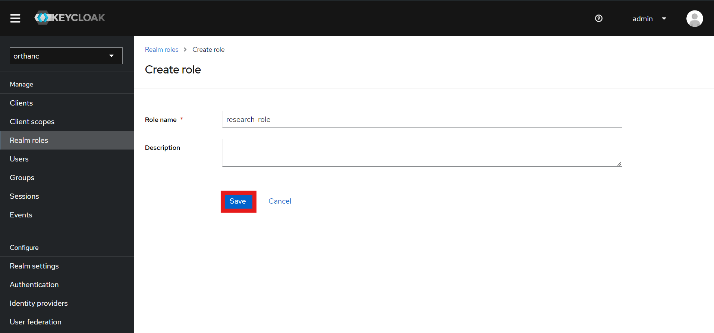
2. add User
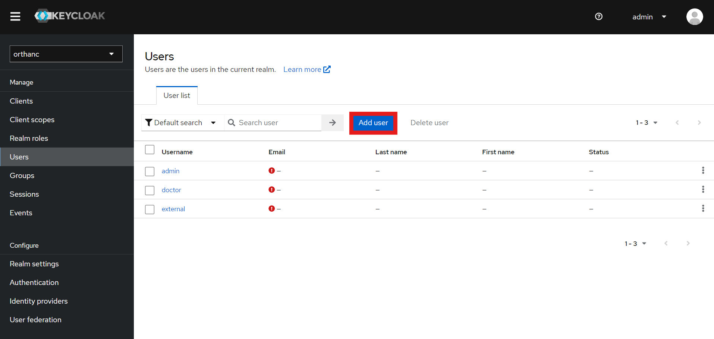
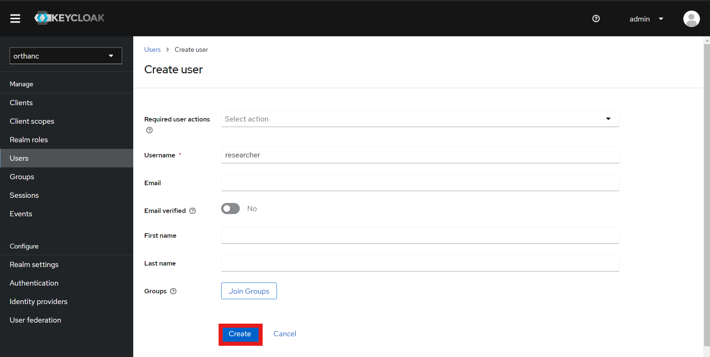
3. assign Role
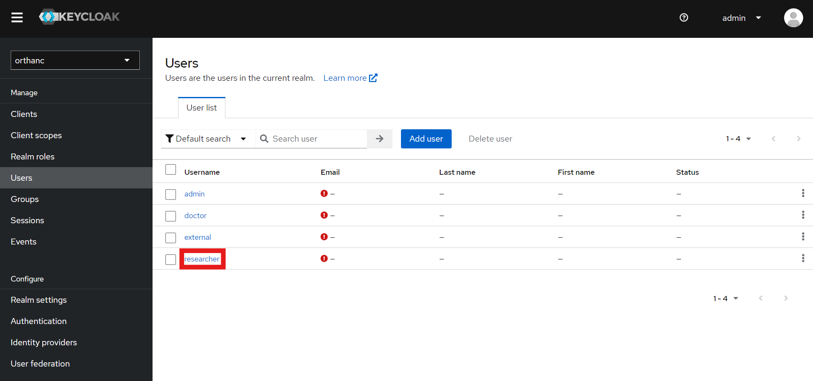
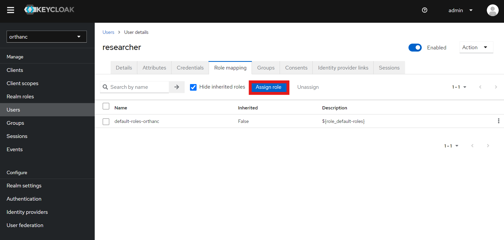
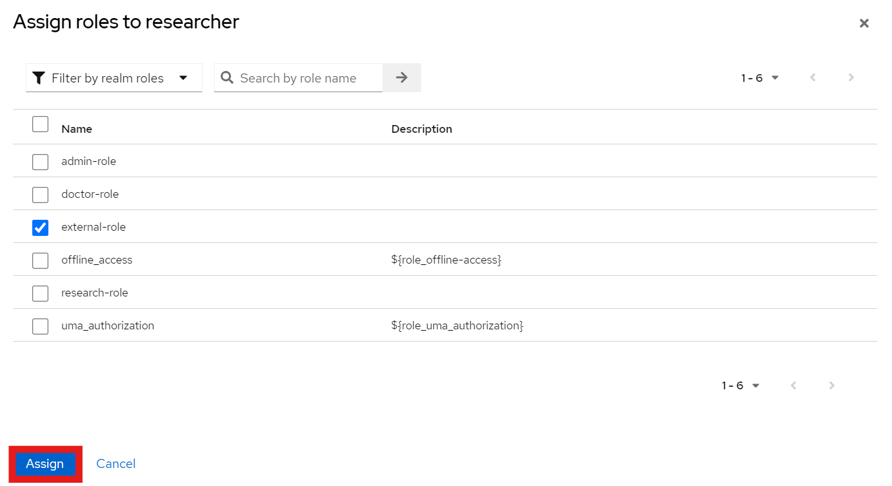

4. add password
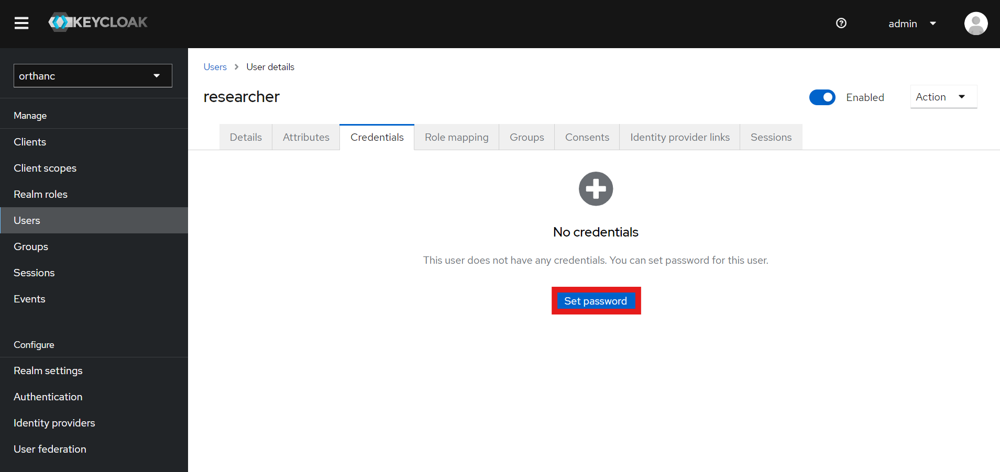
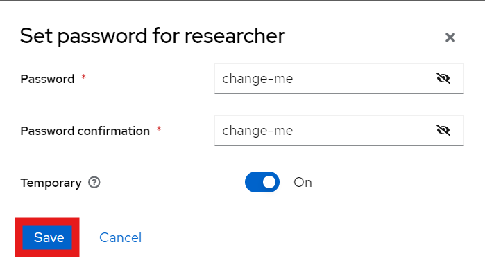

5. add [permissions](./permissions.jsonc) 
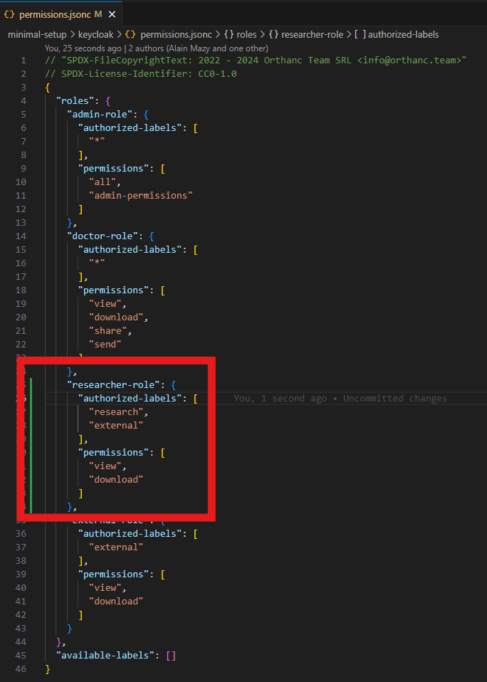
6. restart: `ctrl+c` in terminal -> `docker compose up` -> connect to the new user (username: researcher / pwd: change-me)

