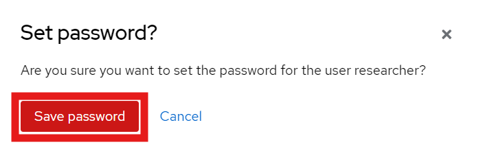

0. `docker compose up` -> connect to the admin console as admin http://localhost/keycloak (username: admin / pwd: change-me) and change to Orthanc Realm

1. add a Realm Role 

2. add User

3. assign Role

4. add password

5. add [permissions](./permissions.jsonc) 

6. connect as admin and add a study with the `research` flag and press enter

7. restart: `ctrl+c` in terminal -> `docker compose up` -> http://localhost/ -> connect to the new user (username: researcher / pwd: change-me)
8. you should see the study with researcher (with the research tag) but not see it with the external account
